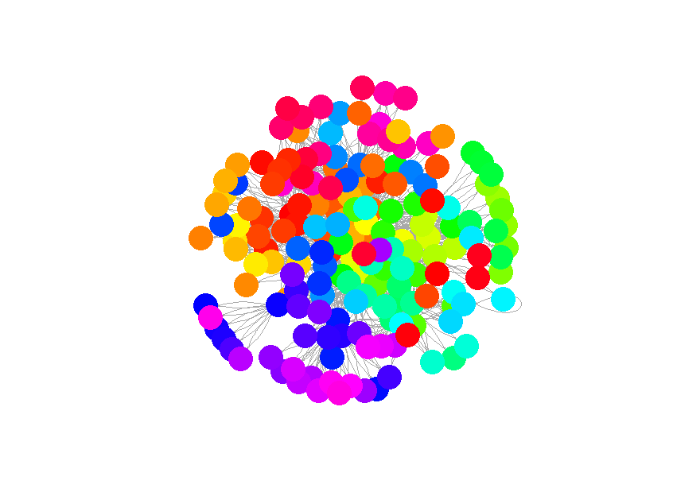
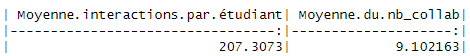

```{=html}
<style>
body {
text-align: justify}
</style>
```
\section*{Auteurs}

Yuriko Archambault \\ Marie-Ève Gagné \\ Juliette Larrivée \\ Daphnée Longworth \\

# Résumé

Les réseaux écologiques sont des outils qui sont pertinents pour illustrer les liens dans les écosystèmes. Ils peuvent également être utilisés comme réseaux de collaboration pour montrer les liens entre les différents collaborateurs. Dans ce rapport, le réseau de collaboration entre les étudiants en biologie de l'université de Sherbrooke a été analysé afin de le comparer aux réseaux écologiques observés dans la nature. Il a été montré que plusieurs similitudes entre le réseau de collaborations des étudiants et ceux observés dans l'environnement étaient observables. Notamment, la propension des étudiants à retravailler avec les mêmes partenaires et celles de travailler avec d'autres étudiants de la même cohorte et du même programme.

------------------------------------------------------------------------

# Introduction

Les réseaux écologiques permettent d'illustrer les liens entre différentes espèces ou entre différents individus d'une même espèce ou d'un même groupe ainsi qu'avec leur environnement. Ils sont très utiles pour mieux comprendre les interactions dans un écosystème et peuvent donc être d'une grande aide en conservation [@Windsor2023; @Delmas2019]. Ce type de réseaux est utile en écologie, mais peut également servir à d'autres domaines, comme les sciences sociales. En effet, les réseaux de collaborations sont pertinents pour mieux comprendre la dynamique et les échanges dans des groupes de travail ou dans des groupes sociaux [@Lau2017]. Il arrive que certains schémas d'interactions soient observés dans plusieurs groupes d'espèces ou plusieurs espèces dans la nature. Ainsi, ce projet s'intéresse à la similarité entre les propriétés des réseaux écologiques naturels et celles du réseau de collaboration chez les étudiants des différents baccalauréats en biologie de l'université de Sherbrooke. Plus précisément, il cherche à déterminer si les étudiants interagissent davantage avec des étudiants du même programme qu'eux, si les étudiants collaborent principalement avec des étudiants de la même cohorte et si les étudiants préfèrent travailler avec les mêmes collaborateurs à plusieurs reprises.

# Méthode

La collecte des données a été réalisée auprès des étudiants inscrits dans le cours de méthodes en écologie computationnelle (BIO500). Elle a été effectuée sous la forme d'un fichier Excel à remplir. Ainsi, il a été possible d'amasser des informations pertinentes sur chacun des étudiants et sur chacune des collaborations qu'ils ont réalisées au courant des différentes sessions et des différents cours de leurs programmes universitaires. Trois tables distinctes ont résulté de cette collecte de données, soit une table étudiant qui contient les informations sur les étudiants eux-mêmes et tous ceux avec qui ils ont collaboré soit les noms, les programmes et la cohorte. La deuxième table, collaboration, indique toutes les interactions que l'étudiant a eues avec d'autres étudiants au courant de son baccalauréat, le sigle du cours dans lequel l'interaction a eu lieu et la session correspondante. Finalement, la dernière table, cours, contient les informations sur les sigles des cours, le nombre de crédits correspondants et si le cours est obligatoire ou optionnel.

Par la suite, les étapes de compilations des données, d'analyses et de rédaction du rapport ont toutes été réalisées à partir de R studio et de certaines de ses extensions. Plus spécifiquement, un nettoyage des données a d'abord été réalisé à partir de code R, puis les données regroupées et nettoyées ont été injectées dans des bases de données SQLite. Des requêtes à partir des bases de données SQLite ont permis de répondre aux questions d'analyses. Les résultats de ses différentes requêtes ont ensuite été convertis sous forme de graphiques et d'illustrations à l'aide de code sur R et de certaines extensions, tel igraph. Target a permis d'automatiser l'exécution du projet, puis le rapport a été rédigé à l'aide de R Markdown. Le répertoire de travail a été sauvegardé sur un dépôt GitHub.

# Résultats

Illustration 1: Réseau des étudiants
```{r, out.width='50%'}

```


L'illustration 1 illustre le réseau d'interractions entre les étudiants de sherbrooke.


Tableau 1 : Moyennes d'interractions
```{r, out.width='100%'}

```

Le tableau 1 montre la moyenne d'interractions pour les étudiants et le nombre de collaborations entre paires d'étudiants.

Figure 1 : Nombre de fois qu'une paire d'étudiant va travailler ensemble 

```{r, echo = FALSE}
data <- read.csv("resultats2.csv")
library(dplyr)
pairs <- data %>%
  count(etudiant1, etudiant2, name = "freq") %>%
  arrange(desc(freq))
library(ggplot2)
```{r, fig.width=3, fig.height=2, echo = FALSE}
ggplot(pairs, aes(x = freq)) +
  geom_bar(stat = "count", fill = "steelblue") +
  scale_x_continuous(breaks = seq
        (0, max(pairs$freq), by = 2)) +
  xlab("Nb de collaborations") +
  ylab("Nb de paires d'étudiants") +
  ggtitle("Nb qu'une paire d'étudiant 
          va travailler ensemble")

```

Les résultats obtenus montrent qu'une proportion des étudiants en biologie de l'université de Sherbrooke préfèrent collaborer avec les mêmes personnes. En effet, certains individus sont plutôt en retrait du réseau et semblent collaborer avec un nombre restreint de personnes qui sont toujours les mêmes. Il est également intéressant de noter que certains étudiants sont liés au reste du réseau uniquement par un autre étudiant qui a collaboré avec le reste du réseau. Aussi, les étudiants qui se retrouvent au centre du réseau sont ceux qui ont collaboré avec le plus grand nombre d'étudiants. Il semble y avoir une majorité d'étudiants qui collaborent avec plusieurs personnes différentes et quelques groupes plus en retrait.


Préférence de collègue pour les étudiants. Comme illustré dans la figure 1, la pente négative nous indique que les étudiants de biologie semblent ne pas préférer travailler avec les mêmes étudiants. Si on a une courbe qui va vers le bas, oui les étudiants préfèrent travailler avec d'autres étudiants.

# Discussion

Dans la nature, les espèces qui cohabitent ensemble et qui ont interagi entre elles une première fois ont une probabilité raisonnable d'interagir ensemble si elles se rencontrent à nouveau [@Delmas2019; @Olesen2011]. Ainsi, les résultats obtenus montrent que les étudiants en biologie de l'université de Sherbrooke ont un comportement similaire. En effet, la figure X permet d'observer que la majorité des élèves ont collaboré plus d'une fois avec les mêmes personnes. Aussi, dans cette situation, on peut considérer que les étudiants d'un même programme ou d'une même cohorte sont des individus qui cohabitent ensemble. Cette situation est plutôt logique. En effet, les étudiants ayant collaboré avec une personne dans le passé qui ont été satisfaits du fruit de cette collaboration ont avantage à refaire une collaboration avec cette même personne, car ils savent à quoi s'attendre, ils sont donc confiants par rapport au résultat de la collaboration. Aussi, les résultats obtenus montrent que les étudiants d'un même programme vont collaborer plus souvent avec des individus qui proviennent du même programme qu'eux (figure X). De ce fait, on peut faire le parallèle avec les individus d'une même espèce. Dans la nature, les individus ont tendance à interagirent plus fréquemment avec des individus de la même espèce qu'eux lorsqu'il s'agit d'une espèce grégaire [@Poisot2014; @Lau2017; @Landi2018]. En outre, les étudiants semblent avoir un comportement similaire si le programme d'étude est considéré comme une espèce. Cette tendance que les élèves ont de collaborer avec d'autres étudiants issus du même programme d'étude pourrait s'expliquer de plusieurs façons. D'abord, comme énoncé plus haut, il est plus simple de collaborer avec des individus que nous connaissons déjà. Ensuite, les étudiants pourraient vouloir collaborer avec d'autres étudiants du même programme qu'eux même, et ce même s'ils n'ont jamais collaboré auparavant, car ils ont des connaissances similaires. Ainsi, ils peuvent se fier que la personne aura des aptitudes semblables pour réaliser le projet.

# Conclusion

Somme toute, il est possible de constater qu'il y a certaines ressemblances entre les réseaux écologiques et le réseau de collaboration entre les étudiants de biologie. En effet, comme observé en nature, il est possible de constater une tendance chez certains étudiants de collaborer avec les mêmes personnes à plusieurs reprises. De plus, les étudiants d'une même cohorte et d'un même programme collaborent plus souvent entre eux. Ces similitudes entre les réseaux écologiques et le réseau de collaboration des étudiants permettent de se demander si, peu importe l'espèce, tous les animaux ont une certaine tendance à rechercher la collaboration de ceux qui les ressemblent le plus.

# Bibliographie
